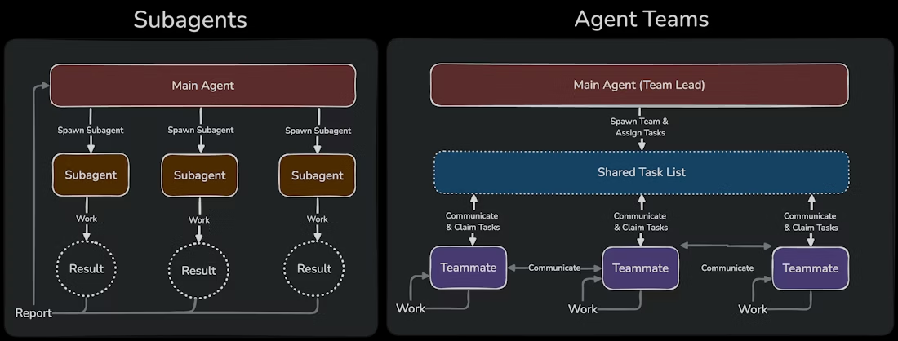

# CC Skills Template

Claude Code의 능력을 극대화하는 **프로덕션-레디 스킬 모음**입니다.
간단한 프롬프트 하나로 여러 AI 에이전트가 팀을 이루어 병렬로 작업하고, 서로 교차검증하며, 단일 에이전트보다 **더 빠르고, 더 정확하고, 더 안전한** 결과를 만들어냅니다.


> **Subagents vs Agent Teams**: Subagents는 개별 결과를 반환하는 독립 워커인 반면, Agent Teams는 공유 태스크 리스트와 양방향 통신으로 협업하는 팀입니다.

---

## Performance Benchmarks

> **4개 스킬, 12개 eval 시나리오, 58개 assertion**에 대한 정량 평가 결과입니다.
> 각 시나리오를 스킬 적용 / 미적용(baseline)으로 실행하여 pass rate, 실행 시간, 토큰 비용을 비교했습니다.

### 종합 결과

```
┌──────────────────────────────────────────────────────────────────────────┐
│                         Assertion Pass Rate                              │
│                                                                          │
│  agent-teams   ██████████████████████████████████████████  100%  (+94%) │
│  codex-cli     ██████████████████████████████████████████  100%  (+43%) │
│  gemini-cli    ██████████████████████████████████████████  100%  (+15%) │
│  gemini-image  █████████████████████████████████████░░░░░   92%  (+83%) │
│  ─────────────────────────────────────────────────────────────────────── │
│  baseline avg  ██████████████████████░░░░░░░░░░░░░░░░░░░░   41%        │
│                                                                          │
│  Overall: 41% → 97%  (+56 pp)   58 assertions, 12 scenarios            │
└──────────────────────────────────────────────────────────────────────────┘
```

| 지표 | with_skill | baseline | Delta |
|:-----|:----------:|:--------:|:-----:|
| **Overall Pass Rate** | **97.3%** | 41.4% | **+56 pp** |
| 평균 실행 시간 / Eval | 118.4s | 87.6s | +35% |
| 평균 토큰 소비 / Eval | 18,272 | 14,627 | +25% |

> **ROI**: 토큰 +25% 추가 비용으로 품질 +56 pp 향상 — **토큰 1% 추가당 2.2 pp 품질 개선**

---

### 스킬별 상세 분석

#### 1. Agent Teams — Pass Rate: 6% → 100% (+94 pp)

가장 임팩트가 큰 스킬. 스킬 없이는 Claude가 단일 에이전트 순차 작업으로 fallback하여 팀 협업 자체가 불가능합니다.

| Eval 시나리오 | with_skill | baseline | 검증 항목 |
|:---|:---:|:---:|:---|
| **풀스택 기능 구현** (JWT auth API + 테스트) | **7/7** (100%) | 0/7 (0%) | TeamCreate, team_name 파라미터, 파일 소유권 분리, 테스트 teammate |
| **버그 조사** (주문 금액 오계산) | **6/6** (100%) | 1/6 (17%) | Explore teammate, 병렬 조사, SendMessage 협업 |
| **코드 리뷰 + 교차검증** (보안/성능/정확성) | **7/7** (100%) | 0/7 (0%) | 다관점 리뷰팀, Codex CLI 호출, `/tmp/xv/` 아티팩트 |

> **핵심 발견**: 스킬 없이는 `Agent(team_name=...)`을 아예 사용하지 않음 — 병렬 협업과 교차검증 능력이 완전히 사라집니다.

---

#### 2. Codex CLI — Pass Rate: 57% → 100% (+43 pp)

> **참고**: 아래 벤치마크는 raw `codex exec` 패턴 기반의 이전 스킬로 측정되었습니다. 현재 스킬은 openai/codex-plugin-cc 플러그인 기반으로 재작성되었습니다.

존재하지 않는 플래그를 hallucinate하는 것을 방지하고, 올바른 호출 패턴을 보장합니다.

| Eval 시나리오 | with_skill | baseline | 핵심 차이 |
|:---|:---:|:---:|:---|
| **기본 코드 리뷰** (calculator.py 로직 검증) | **6/6** (100%) | 0/6 (0%) | baseline이 존재하지 않는 `--approval-mode` 플래그 사용 |
| **보안 감사 + XV 아티팩트** (auth 모듈) | **7/7** (100%) | 5/7 (71%) | baseline이 timeout 래핑 + 표준 아티팩트 포맷 누락 |
| **미설치 시 Fallback** (graceful degradation) | **5/5** (100%) | 5/5 (100%) | 둘 다 통과 (에이전트가 프로젝트 내 스킬 파일 탐색) |

<table>
<tr><th>지표</th><th>with_skill</th><th>baseline</th><th>Delta</th></tr>
<tr><td>Pass Rate</td><td><strong>100%</strong></td><td>57%</td><td><strong>+43 pp</strong></td></tr>
<tr><td>평균 실행 시간</td><td>56.4s</td><td>69.2s</td><td><strong>-18.5%</strong> (더 빠름)</td></tr>
<tr><td>평균 토큰</td><td>15,342</td><td>14,792</td><td>+3.7%</td></tr>
</table>

> **핵심 발견**: 스킬이 **더 빠르면서 더 정확함** — 올바른 패턴을 즉시 제공하여, baseline 에이전트가 `codex --help` 탐색에 평균 12.8초를 소비하는 오버헤드를 제거합니다.

**Discriminating assertions** (스킬 유무에 따라 결과가 갈리는 항목):

| Assertion | with_skill | baseline | 중요한 이유 |
|:---|:---:|:---:|:---|
| `codex exec` 모드 사용 | PASS | FAIL | baseline이 interactive 플래그를 hallucinate |
| `--ephemeral` 플래그 | PASS | FAIL | 세션 지속성 누출 방지 |
| `-s read-only` sandbox | PASS | FAIL | 보안: 파일 시스템 쓰기 차단 |
| `-o` 파일 출력 | PASS | FAIL | 구조화된 아티팩트 수집 |
| `timeout` 래핑 | PASS | FAIL | 무한 대기 방지 |
| heredoc/cat 패턴 | PASS | FAIL | 올바른 stdin 처리 (Codex는 positional arg 사용 시 stdin 무시) |

---

#### 3. Gemini CLI — Pass Rate: 85% → 100% (+15 pp)

프로덕션 장애를 예방하는 운영 안전성 패턴을 추가합니다.

| Eval 시나리오 | with_skill | baseline | 핵심 차이 |
|:---|:---:|:---:|:---|
| **코드 리뷰** (Python 파일 분석) | **7/7** (100%) | 4/7 (57%) | baseline: timeout, `-y`, stderr 억제 미사용 |
| **웹 검색** (Node.js 22 LTS 변경사항) | **7/7** (100%) | 7/7 (100%) | 둘 다 통과 (baseline이 `--help`에서 학습) |
| **집중 리뷰** (SQL injection + cache 이슈) | **6/6** (100%) | 6/6 (100%) | 둘 다 통과 |

<table>
<tr><th>지표</th><th>with_skill</th><th>baseline</th><th>Delta</th></tr>
<tr><td>Pass Rate</td><td><strong>100%</strong></td><td>85%</td><td><strong>+15 pp</strong></td></tr>
<tr><td>평균 실행 시간</td><td>171.7s</td><td>151.4s</td><td>+13%</td></tr>
<tr><td>평균 토큰</td><td>15,012</td><td>15,100</td><td>-0.6%</td></tr>
</table>

> **핵심 발견**: 이 스킬의 핵심 가치는 **운영 안전성** — timeout 래핑(인증 관련 hang 방지), `-y` 플래그(interactive blocking 방지), stderr 억제. 이 패턴들은 `--help`만으로는 발견할 수 없는 프로덕션 필수 패턴입니다.

**Discriminating assertions** (code-review eval):

| Assertion | with_skill | baseline |
|:---|:---:|:---:|
| `timeout` 래핑 | PASS | FAIL |
| `-y` auto-approve 플래그 | PASS | FAIL |
| `2>/dev/null` stderr 억제 | PASS | FAIL |

---

#### 4. Gemini Image — Pass Rate: 8% → 92% (+83 pp)

가장 극적인 품질 도약. 구버전 스킬은 SDK 비호환으로 이미지를 하나도 생성하지 못했습니다.

| Eval 시나리오 | with_skill | baseline (구버전) | 핵심 차이 |
|:---|:---:|:---:|:---|
| **아이콘 생성** (256x256 블루 로고) | **3/4** (75%) | 1/4 (25%) | 구버전: SDK 크래시. 신버전: 직접 API 호출로 복구 |
| **히어로 배너** (16:9 2K gradient) | **4/4** (100%) | 0/4 (0%) | 구버전: 완전 실패. 신버전: 올바른 플래그 + 생성 성공 |
| **다중 썸네일** (AI 테마 3개 변형) | **3/3** (100%) | 0/3 (0%) | 구버전: 이미지 0개. 신버전: `-n 3` + 올바른 출력 경로 |

<table>
<tr><th>지표</th><th>with_skill</th><th>baseline (구버전)</th><th>Delta</th></tr>
<tr><td>Pass Rate</td><td><strong>91.7%</strong></td><td>8.3%</td><td><strong>+83 pp</strong></td></tr>
<tr><td>평균 실행 시간</td><td>179.3s</td><td>72.4s</td><td>+147%</td></tr>
<tr><td>평균 토큰</td><td>25,463</td><td>15,990</td><td>+59%</td></tr>
</table>

> **핵심 발견**: 구버전 스킬의 스크립트가 SDK v1.27.0 비호환으로 크래시했지만, 개선된 스킬의 워크플로우 가이드 덕분에 에이전트가 **자율적으로 직접 API를 호출하여 복구** — 스크립트가 실패해도 이미지를 생성해냈습니다. 추가 시간/토큰은 이 복원 과정에서 발생한 것입니다.

---

### 스킬 간 종합 비교

```
                    스킬별 Pass Rate 개선 폭
                    ═══════════════════════

  agent-teams  │██████████████████████████████████████████████░░│  +94 pp
  gemini-image │████████████████████████████████████████████░░░░│  +83 pp
  codex-cli    │██████████████████████░░░░░░░░░░░░░░░░░░░░░░░░░│  +43 pp
  gemini-cli   │████████░░░░░░░░░░░░░░░░░░░░░░░░░░░░░░░░░░░░░░│  +15 pp
               └────────────────────────────────────────────────┘
                0        20        40        60        80       100
```

| 분석 관점 | 상세 |
|:----------|:-----|
| **최고 임팩트** | agent-teams (+94 pp) — 스킬 없이는 존재하지 않는 능력(팀 협업)을 활성화 |
| **최고 ROI** | codex-cli — 토큰 +3.7%만으로 +43 pp, 게다가 **18.5% 더 빠름** |
| **최고 복원력** | gemini-image — SDK 크래시 상황에서 에이전트가 자율 복구하여 결과물 생성 |
| **최고 정밀도** | gemini-cli — 정확히 3개의 운영 안전성 assertion만으로 +15 pp |
| **비차별 항목** | "CLI 호출됨" assertion은 모든 config에서 통과 — 에이전트는 도구 자체는 스킬 없이도 찾아서 실행 가능 |
| **차별 항목** | 플래그 패턴, 아티팩트 포맷, sandbox 모드 — 에이전트는 *올바른 호출 방법*을 알기 위해 스킬이 필요 |

### Methodology

- **환경**: Claude Opus 4.6 (1M context)
- **일시**: 2026-03-20
- **시나리오**: 총 12개 (스킬당 3개)
- **Assertion**: 총 58개 (객관적 검증 가능)
- **비교 구성**: with_skill vs. without_skill (codex-cli, gemini-cli, agent-teams) / with_skill vs. old_skill (gemini-image)
- **실행 횟수**: config당 시나리오당 1회
- **Raw data**: `*-workspace/iteration-1/` 디렉토리 (benchmark.json, grading.json, timing.json)

---

## 포함된 스킬

```
.claude/skills/
├── agent-teams/                         # 멀티 에이전트 팀 협업 + 교차검증
│   ├── SKILL.md                         # 팀 구성 + 필수 앙상블 규칙 + 아티팩트 패턴
│   ├── evals/                           # 3 시나리오 (풀스택/디버깅/리뷰) 평가
│   │   └── evals.json
│   └── references/
│       ├── team-sizing.md               # 팀 규모 가이드 + 역할 템플릿
│       └── cross-verification.md        # 교차검증 워크플로 + 3-way 게이트
│
├── codex-cli/                           # OpenAI Codex 플러그인 통합
│   ├── SKILL.md                         # 플러그인 명령어 + 프롬프트 구성 + 리뷰
│   ├── evals/                           # 3 시나리오 (리뷰/보안/알고리즘) 평가
│   │   └── evals.json
│   └── references/
│       └── plugin-integration.md        # 컴패니언 스크립트, 팀메이트 패턴, 프롬프트 블록
│
├── gemini-cli/                          # Google Gemini CLI 서브에이전트
│   ├── SKILL.md                         # 핵심 호출 패턴 + 플래그 + 제한사항
│   ├── evals/                           # 3 시나리오 (코드리뷰/웹검색/보안) 평가
│   │   └── evals.json
│   └── references/
│       ├── invocation-patterns.md       # JSON envelope, 동시실행, 에러코드, 빌트인 툴
│       └── review-patterns.md           # 코드리뷰/보안감사/웹검색 프롬프트 템플릿
│
└── gemini-image/                        # Gemini 이미지 생성
    ├── SKILL.md                         # 프롬프트 가이드 + 파라미터
    ├── evals/                           # 3 시나리오 (로고/배너/썸네일) 평가
    │   └── evals.json
    └── scripts/
        └── generate_image.py            # 이미지 생성 스크립트 (모델 폴백, 자동 재시도)
```

| 스킬 | 설명 | 핵심 강점 | 평가 |
|------|------|-----------|------|
| **agent-teams** | 멀티 에이전트 팀 협업 + 교차검증 | 병렬 작업, 태스크 분배, 팀 간 양방향 통신, 3-way 게이트 | 3 시나리오 100% pass |
| **codex-cli** | OpenAI Codex 플러그인 통합 | 독립 코드 리뷰, 태스크 위임, 교차검증, 구조화 리뷰 JSON, XML 프롬프트 구성 | 3 시나리오 평가 포함 |
| **gemini-cli** | Google Gemini CLI 서브에이전트 | 14개 빌트인 툴, 실시간 웹 검색, 코드 리뷰 | 3 시나리오 평가 포함 |
| **gemini-image** | Gemini 3.1 Flash 이미지 생성 | 4개 모델 폴백, 참조 이미지 변환, 다중 생성, 자동 재시도 | 3 시나리오 평가 포함 |

---

## 설정 가이드

### 1. Agent Teams 활성화

Agent Teams는 실험적 기능으로, 환경변수를 설정해야 활성화됩니다.

**방법 A: settings.json (권장)**

`~/.claude/settings.json` 파일에 추가:

```json
{
  "env": {
    "CLAUDE_CODE_EXPERIMENTAL_AGENT_TEAMS": "1"
  }
}
```

**방법 B: 셸 환경변수**

```bash
export CLAUDE_CODE_EXPERIMENTAL_AGENT_TEAMS=1
claude
```

> 셸 시작 시 자동 적용하려면 `~/.bashrc` 또는 `~/.zshrc`에 위 export 줄을 추가하세요.

**표시 모드 설정 (선택)**

```json
{
  "teammateMode": "tmux"
}
```

| 모드 | 설명 | 요구사항 |
|------|------|----------|
| `auto` (기본) | tmux 있으면 분할 패널, 없으면 인프로세스 | 없음 |
| `in-process` | 메인 터미널에서 `Shift+Up/Down`으로 팀원 전환 | 없음 |
| `tmux` | 각 팀원이 별도 패널에 표시 | tmux 설치 필요 |

---

### 2. Gemini Image (이미지 생성)

Gemini 3.1 Flash 모델로 이미지를 생성합니다. **유료 계정이 필요합니다.**

1. [Google AI Studio](https://aistudio.google.com/)에서 API 키 발급
2. 프로젝트 루트에 `.env` 파일 생성:

```bash
GEMINI_API_KEY=AIza...your-key-here
```

> `.env` 파일은 반드시 `.gitignore`에 추가하여 API 키가 커밋되지 않도록 하세요.

사용 예시:

```bash
# 기본 이미지 생성
python3 .claude/skills/gemini-image/scripts/generate_image.py "minimalist dashboard icon, blue" -o icon.png

# 고해상도 와이드 배너
python3 .claude/skills/gemini-image/scripts/generate_image.py "dark mode hero banner" -o banner.png --aspect 16:9 --size 2K

# 기존 이미지를 다크모드로 변환
python3 .claude/skills/gemini-image/scripts/generate_image.py "Convert to dark mode" -r light-theme.png -o dark-theme.png

# 3개 변형 동시 생성
python3 .claude/skills/gemini-image/scripts/generate_image.py "AI themed thumbnail" -o thumb.png -n 3
```

---

### 3. Gemini CLI (Gemini 서브에이전트)

Google Gemini CLI를 서브에이전트로 사용합니다. **14개 빌트인 툴**(파일 읽기/쓰기, 웹 검색, grep 등)로 코드 리뷰, 실시간 웹 검색, 프론트엔드 분석에 활용됩니다.

```bash
# 설치
npm install -g @google/gemini-cli

# 설치 확인 (v0.32.1 이상 필요)
gemini --version

# 최초 인증 (브라우저에서 Google 계정 로그인)
gemini
```

> 모델은 **auto**를 권장합니다. 별도 설정 없이 Gemini CLI가 자동으로 적절한 모델을 선택합니다.

---

### 4. Codex CLI (Codex 플러그인)

OpenAI Codex를 **openai/codex-plugin-cc** 플러그인을 통해 사용합니다. 플러그인이 코드 리뷰, 태스크 위임, 잡 관리, 스레드 재개 등을 관리합니다.

```bash
# Codex CLI 설치
npm install -g @openai/codex

# 인증 (브라우저에서 ChatGPT 계정 로그인)
codex login

# 플러그인 설치
/plugin marketplace add openai/codex-plugin-cc
/plugin install codex@openai-codex
/reload-plugins

# 설치 확인
/codex:setup
```

주요 명령어:

| 명령어 | 설명 |
|--------|------|
| `/codex:setup` | 설치/인증 확인, 리뷰 게이트 설정 |
| `/codex:review` | 네이티브 코드 리뷰 (git 변경사항) |
| `/codex:adversarial-review` | 어드버서리얼 리뷰 (커스텀 포커스) |
| `/codex:rescue` | 태스크 위임 (진단, 수정, 리서치) |
| `/codex:status` | 잡 상태 모니터링 |
| `/codex:result` | 완료된 잡 결과 조회 |
| `/codex:cancel` | 실행 중인 잡 취소 |

---

### 빠른 체크리스트

| 스킬 | 필요한 것 | 확인 방법 |
|------|-----------|-----------|
| Agent Teams | 환경변수 `CLAUDE_CODE_EXPERIMENTAL_AGENT_TEAMS=1` | `~/.claude/settings.json` 확인 |
| Gemini Image | `.env`에 `GEMINI_API_KEY` 등록 | `cat .env \| grep GEMINI` |
| Gemini CLI | `gemini` 설치 + OAuth 인증 | `gemini --version` |
| Codex CLI | `codex` 설치 + ChatGPT 로그인 + 플러그인 설치 | `/codex:setup` (ready 확인) |

---

## 교차검증 시스템 (Cross-Verification)

작업 유형에 따라 **반드시** 사용해야 하는 AI 앙상블 조합입니다.

### 필수 앙상블 규칙

| 작업 유형 | 필수 앙상블 | 이유 |
|-----------|-------------|------|
| 코드 분석, 알고리즘, 수학/이론 | Claude + **Codex** | Codex의 논리적 추론 + 코드 정확성 |
| 디버깅, 근본 원인 분석 | Claude + **Codex** | 코드 레벨 독립 분석으로 사각지대 제거 |
| 보안 감사 | Claude + **Codex** | 최소 2개 독립 보안 관점 필수 |
| 성능 분석, 최적화 리뷰 | Claude + **Codex** | 핫패스, N+1 쿼리, 비동기 패턴 검증 |
| 프론트엔드 리뷰, UI 패턴, 웹 리서치 | Claude + **Gemini** | Gemini 빌트인 웹 검색으로 최신 패턴 확인 |
| E2E 시각 회귀, 스크린샷 검증 | Claude (네이티브 VLM) + **Gemini** (코드 리뷰) | Claude가 이미지 직접 분석 |
| 아키텍처 설계, 계획, 제안서 | Claude + **Codex** + **Gemini** (3-way 게이트) | 3명 모두 통과해야 진행 |

### AI 에이전트별 강점 비교

| 능력 | Claude (네이티브) | Gemini CLI | Codex 플러그인 |
|------|------------------|------------|-----------|
| 코드 로직 리뷰 | Excellent | Good | Excellent |
| 이미지/스크린샷 분석 | **Excellent (네이티브)** | CLI 미지원 | 미지원 |
| 웹 검색 | WebSearch 툴 | **빌트인 (`-y` 플래그)** | 미지원 |
| 구조화 출력 | 툴 기반 | `-o json` | **구조화 리뷰 JSON** (verdict, findings, next_steps) |
| 브랜치 diff 리뷰 | git 툴 | 수동 | **`adversarial-review --base`** |
| 속도 | 즉시 | ~3-25s | ~3-15s |
| 잡 관리 | N/A | N/A | **스레드 재개, 백그라운드 실행, 상태 추적** |

### 신뢰도 판정 기준

```
CRITICAL (전원 합의)  →  반드시 수정 — 예외 없음
HIGH     (2/3 합의)   →  수정 권장, 불일치 원인 조사 필요
MEDIUM   (1/3만 지적) →  조사 필요, 대부분 오탐(false positive)
```

### 아티팩트 기반 커뮤니케이션

CLI 에이전트(Gemini/Codex)는 Claude Code 팀과 직접 메시지를 주고받을 수 없습니다. 대신 `/tmp/xv/{task-name}/`에 구조화된 아티팩트 파일을 드롭하고, Claude Code 팀원이 읽는 방식으로 소통합니다:

```
/tmp/xv/{task-name}/
├── plan_draft.md              # Claude 팀의 설계안
├── claude_review.md           # Claude 팀의 리뷰
├── codex_review.md            # Codex CLI가 작성
├── codex_critique.md          # Codex CLI가 작성 (설계 비평)
├── gemini_review.md           # Gemini CLI가 작성
├── gemini_critique.md         # Gemini CLI가 작성 (설계 비평)
├── gemini_research.md         # Gemini 웹 검색 결과
└── synthesis_report.md        # 최종 종합 보고서
```

**표준 아티팩트 형식** (모든 리뷰/비평 파일이 따라야 하는 형식):

```markdown
# [Agent] Review - {대상 파일명}
Date: {timestamp}
Status: PASS | FAIL | PASS_WITH_COMMENTS

## Findings
- [CRITICAL] Line N: 설명
- [HIGH] Line N: 설명

## Summary
1-3문장 요약

## Verdict: APPROVE | REQUEST_CHANGES
```

---

## 활용 예제

> `/agent-teams` 하나만 호출하면, 내부적으로 작업 내용을 분석하여 필요한 스킬(`gemini-image`, `codex-cli`, `gemini-cli` 등)을 자동으로 로딩하고 최적의 팀을 구성합니다. 프롬프트에는 **무엇을 원하는지**만 자연어로 작성하세요.

### 대표 예제: SaaS 랜딩페이지 — AI 이미지 생성 + 자동 검증 루프

> **"우리 SaaS 제품 랜딩페이지 만들어줘. 히어로 섹션, 기능 소개, 가격표, CTA 포함. 히어로 배너랑 아이콘도 AI로 생성하고, 최신 트렌드 반영해서 성능/접근성까지 검증해줘. /agent-teams"**

이 예제는 **모든 스킬을 조합**하여, AI가 이미지를 생성하고 랜딩페이지에 녹여내고, 스크린샷을 찍어 자가 평가한 뒤, 점수가 기준에 도달할 때까지 **자동으로 루프를 돌며 개선**하는 워크플로우입니다.

#### 팀 구성 (8명)

| 에이전트 | 역할 | 사용 스킬 | 작업 내용 |
|----------|------|-----------|-----------|
| `architect` | 설계 | claude (mode=plan) | 랜딩페이지 구조 설계, 섹션별 와이어프레임 |
| `image-gen` | 이미지 생성 | **gemini-image** | 히어로 배너, 기능 아이콘, 일러스트, 배경 |
| `ui-dev` | 프론트엔드 구현 | claude | HTML/CSS/JS 구현, 생성 이미지 배치 |
| `e2e-runner` | E2E 테스트 | claude (Playwright) | 스크린샷 캡처, 반응형 테스트, 성능 측정 |
| `vlm-judge` | **시각 품질 판정** | **claude (VLM)** | **스크린샷 분석 → 디자인 점수 매기기 (100점)** |
| **`xv-gemini`** | **트렌드 조사** | **gemini-cli** | **최신 랜딩페이지 트렌드 웹 검색** |
| **`xv-codex`** | **코드 품질** | **codex 플러그인** | **성능/접근성/SEO 독립 감사** |
| `synthesizer` | 품질 게이트 | claude | 종합 점수 판정, 루프 계속/종료 결정 |

#### 핵심 메커니즘: 자동 검증 루프

```
                    ┌──────────────────────────────────────────────┐
                    │          DESIGN-VERIFY-REFINE LOOP           │
                    │                                              │
                    │  ┌─────────┐    ┌─────────┐    ┌─────────┐  │
                    │  │ image   │───→│ ui-dev  │───→│  e2e    │  │
                    │  │  -gen   │    │ 구현    │    │ 스크린샷│  │
                    │  └─────────┘    └─────────┘    └────┬────┘  │
                    │       ↑                              │       │
                    │       │                              ↓       │
                    │  ┌─────────┐    ┌─────────┐    ┌─────────┐  │
                    │  │ 프롬프트│←───│synthe-  │←───│  vlm-   │  │
                    │  │ 조정    │    │ sizer   │    │ judge   │  │
                    │  └─────────┘    │ 판정    │    │(gemini) │  │
                    │                 └────┬────┘    └─────────┘  │
                    │                      │                       │
                    │              점수 < 85점?                    │
                    │              YES → 루프 반복                 │
                    │              NO  → 통과                      │
                    └──────────────────────────────────────────────┘
```

#### 워크플로우 전체 흐름

```
사용자: "우리 SaaS 제품 랜딩페이지 만들어줘. 히어로 배너랑
         아이콘도 AI로 생성하고, 최신 트렌드 반영해서
         성능/접근성까지 검증해줘. /agent-teams"
         │
    → /agent-teams가 필요한 스킬 자동 로딩 → 8명 스폰
         │
         ├── Phase 1: 설계 + 트렌드 조사 (병렬) ────────────────┐
         │                                                        │
         │   architect ──── 랜딩페이지 구조 설계 (mode=plan)     │
         │   xv-gemini ──── 웹 검색: "2026 SaaS landing page     │
         │                   design trends"                       │
         │     -> glassmorphism + gradient mesh + 3D 일러스트     │
         │                                                        │
         ├── Phase 2: 이미지 생성 ──────────────────────────────┤
         │                                                        │
         │   image-gen ──── gemini-image로 5개 이미지 생성:      │
         │     [1] 히어로 배너 (--aspect 16:9 --size 2K)         │
         │     [2-4] 기능 아이콘 3개 (256x256)                   │
         │     [5] 사용 사례 일러스트 (--aspect 4:3)             │
         │                                                        │
         ├── Phase 3: 구현 ─────────────────────────────────────┤
         │                                                        │
         │   ui-dev ─────── 설계 + 트렌드 + 이미지를 종합하여   │
         │     HTML/CSS/JS 구현 (반응형, glassmorphism)           │
         │                                                        │
         ├── Phase 4: E2E 스크린샷 캡처 ────────────────────────┤
         │                                                        │
         │   e2e-runner ─── Playwright로 desktop/tablet/mobile   │
         │                                                        │
         ├══ Phase 5: 자동 검증 루프 (VLM 점수 기반) ═══════════╡
         │                                                        │
         │   vlm-judge ─── Round 1: 76/100 (기준 85점 미달)      │
         │   → 히어로 배너 가독성 저하, 아이콘 스타일 불일치     │
         │   → image-gen 재생성 + ui-dev 수정                    │
         │                                                        │
         │   vlm-judge ─── Round 2: 84/100 (근접!)               │
         │   → 일러스트 배경색 미세 불일치                        │
         │   → image-gen 재생성 (transparent 배경)               │
         │                                                        │
         │   vlm-judge ─── Round 3: 87/100 (통과!)               │
         │                                                        │
         ├── Phase 6: 최종 교차검증 (병렬) ─────────────────────┤
         │                                                        │
         │   xv-codex ──── Lighthouse: Performance 94, A11y 98   │
         │   xv-gemini ──── 2026 트렌드 부합 확인                │
         │                                                        │
         └───────────────────────────────────────── 완료 ─────────┘
```

#### 최종 결과

```
SaaS 랜딩페이지 — 완성
═══════════════════════
생성 이미지: 7개 (히어로 배너 v2, 아이콘 3개, 일러스트 v2 + 원본 2개)
루프 횟수:   3회 (76점 → 84점 → 87점)
구현 파일:   index.html, styles.css, script.js
반응형:      desktop / tablet / mobile 대응
검증 결과:
  - VLM 시각 품질:  87/100 (기준 85점 통과)
  - Codex 코드 감사: PASS_WITH_COMMENTS (Lighthouse 94점)
  - Gemini 트렌드:   APPROVE (2026 트렌드 부합)

이미지-디자인 융합 점수 변화:
  Round 1:  72/100  ███████░░░  "이미지가 붕 떠 보임"
  Round 2:  88/100  ████████░░  "거의 자연스러움"
  Round 3:  91/100  █████████░  "완전히 녹아듦"
```

> **핵심**: AI가 이미지를 생성하고 끝나는 것이 아니라, **스크린샷 → VLM 점수 → 피드백 → 이미지 재생성 → 재구현**의 루프를 자동으로 반복하여, 생성된 이미지가 웹 디자인에 **완전히 녹아드는 수준**까지 도달합니다.

---

### 예제 1: 풀스택 기능 개발 + 교차검증

> **"결제 시스템에 환불 기능 추가해줘. 부분환불/전체환불 지원하고, 금액 계산 로직은 교차검증해줘. 통합 테스트까지 작성해줘. /agent-teams"**

| 에이전트 | 역할 | 사용 스킬 | 작업 내용 |
|----------|------|-----------|-----------|
| `api-dev` | API 개발 | claude | `POST /refunds`, `GET /refunds/:id` 구현 |
| `service-dev` | 비즈니스 로직 | claude | RefundService, 부분환불/전체환불 로직 |
| `db-migration` | DB 스키마 | claude | refunds 테이블 마이그레이션 |
| `ui-dev` | 프론트엔드 | claude | 환불 요청 UI, 환불 내역 페이지 |
| **`xv-codex`** | **교차검증** | **codex 플러그인** | **결제 금액 계산 로직 독립 검증** |
| `tester` | 테스트 | claude | 통합 테스트, 엣지 케이스 검증 |

```
    /agent-teams
         │
         ├── Phase 1: 병렬 구현 ─────────────────────────────────┐
         │   api-dev ────── POST /refunds 엔드포인트 구현        │
         │   service-dev ── RefundService 비즈니스 로직           │
         │   db-migration ─ refunds 테이블 스키마 설계            │
         │   ui-dev ─────── 환불 요청 폼 + 내역 페이지           │
         │                                                        │
         ├── Phase 2: 교차검증 ──────────────────────────────────┤
         │   xv-codex ─── Codex가 환불 금액 계산 로직 독립 검증  │
         │     -> 쿠폰 비례 배분 오류 발견, service-dev에 전달    │
         │                                                        │
         ├── Phase 3: 통합 테스트 ───────────────────────────────┤
         │   tester ────── 전체 환불 플로우 E2E 테스트            │
         └───────────────────────────────────────── 완료 ─────────┘
```

---

### 예제 2: 프론트엔드 리디자인 + 이미지 생성

> **"대시보드 페이지 다크모드로 리디자인해줘. 목업 이미지 먼저 생성하고, 최신 다크모드 트렌드 조사해서 반영해줘. WCAG 대비율도 검증해줘. /agent-teams"**

| 에이전트 | 역할 | 사용 스킬 | 작업 내용 |
|----------|------|-----------|-----------|
| `ui-designer` | 디자인 컨셉 | **gemini-image** | 다크모드 대시보드 목업 이미지 생성 |
| `ui-dev` | 프론트엔드 구현 | claude | CSS 변수, 테마 토글, 컴포넌트 스타일링 |
| **`xv-gemini`** | **트렌드 조사** | **gemini-cli** | **최신 다크모드 패턴 웹 검색** |
| `vlm-judge` | 시각 검증 | **claude (VLM)** | **구현 결과 스크린샷 vs 목업 비교** |
| `tester` | 접근성 테스트 | claude | WCAG 대비율 검증 |

```
    /agent-teams
         │
         ├── Phase 1: 조사 + 디자인 (병렬) ─────────────────────┐
         │   xv-gemini ──── "2026 dark mode best practices"      │
         │   ui-designer ── gemini-image로 목업 생성              │
         │                                                        │
         ├── Phase 2: 구현 ──────────────────────────────────────┤
         │   ui-dev ─────── 조사 결과 + 목업을 참고하여 구현     │
         │                                                        │
         ├── Phase 3: 시각 검증 ─────────────────────────────────┤
         │   vlm-judge ─── 스크린샷 vs 목업 비교 판정            │
         │   tester ─────── WCAG AA 대비율 검증 통과             │
         └───────────────────────────────────────── 완료 ─────────┘
```

---

### 예제 3: 보안 감사 + 3-way 교차검증

> **"인증 모듈 보안 감사 진행해줘. 독립 취약점 분석하고, 사용 라이브러리 최신 CVE도 조사해서 3-way 교차검증해줘. /agent-teams"**

| 에이전트 | 역할 | 사용 스킬 | 작업 내용 |
|----------|------|-----------|-----------|
| `security-analyst` | 1차 보안 분석 | claude | OWASP Top 10 정적 분석 |
| **`xv-codex`** | **독립 보안 리뷰** | **codex 플러그인** | **인증 플로우 독립 취약점 분석** |
| **`xv-gemini`** | **최신 CVE 조사** | **gemini-cli** | **사용 라이브러리 최신 CVE 웹 검색** |
| `synthesizer` | 3-way 게이트 | claude | 3개 분석 결과 종합 판정 |

```
    /agent-teams
         │
         ├── Phase 1: 3-way 독립 분석 (완전 병렬) ──────────────┐
         │                                                        │
         │   security-analyst (Claude):                           │
         │     [HIGH] JWT alg:none 검증 누락                     │
         │     [MED]  Rate limiting 미적용                       │
         │                                                        │
         │   xv-codex (Codex CLI):                               │
         │     [HIGH] JWT alg:none 검증 누락 (Claude와 일치!)    │
         │     [HIGH] refresh token 재사용 가능 (추가 발견)      │
         │                                                        │
         │   xv-gemini (Gemini CLI):                             │
         │     [CRITICAL] jsonwebtoken < 9.0.3 CVE 발견          │
         │                                                        │
         ├── Phase 2: 3-way 게이트 판정 ─────────────────────────┤
         │                                                        │
         │   ┌─────────────────────────────────────────────┐      │
         │   │  Claude  : FAIL (2건)                       │      │
         │   │  Codex   : FAIL (3건)                       │      │
         │   │  Gemini  : FAIL (1건 CRITICAL)              │      │
         │   │                                             │      │
         │   │  판정: FAIL (3/3 일치)                      │      │
         │   │  고유 취약점: 5건 (중복 제거)               │      │
         │   │  단일 분석 대비 2.5배 더 많은 이슈 포착     │      │
         │   └─────────────────────────────────────────────┘      │
         └───────────────────────────────────────── 완료 ─────────┘
```

> **핵심**: Claude + Codex가 독립적으로 동일한 JWT 취약점을 발견 (높은 신뢰도), Codex가 refresh token 이슈를 추가 발견, Gemini가 웹 검색으로 실시간 CVE 데이터를 제공 — 3가지 관점의 결합으로 단일 분석 대비 **2.5배** 더 많은 취약점을 포착했습니다.

---

### 예제 4: 버그 조사 + 멀티 에이전트 디버깅

> **"프로덕션에서 간헐적 타임아웃 발생하는데 원인 찾아줘. 로그/DB/API/캐시 동시에 조사하고, 코드 레벨 독립 분석도 해줘. /agent-teams"**

| 에이전트 | 역할 | 작업 내용 |
|----------|------|-----------|
| `log-analyst` | 로그 분석 | 에러 로그 패턴 분석, 타임라인 구성 |
| `db-tracer` | DB 추적 | 슬로우 쿼리, 커넥션 풀, 락 경합 조사 |
| `api-tracer` | API 추적 | 엔드포인트별 응답시간, 타임아웃 패턴 |
| `cache-checker` | 캐시 점검 | Redis 히트율, 메모리, 만료 정책 조사 |
| **`xv-codex`** | **독립 분석** | **codex 플러그인으로 코드 레벨 타임아웃 원인 분석** |

```
    /agent-teams (5명 병렬 조사)
         │
         ├── cache-checker:  14:00 캐시 대량 만료 발견 ← 근본 원인
         ├── api-tracer:     14:00 /api/dashboard 응답 200ms → 12s
         ├── db-tracer:      14:00 analytics_events 풀스캔 급증
         ├── log-analyst:    14:00-14:30 타임아웃 에러 집중
         │
         └── xv-codex (코드 레벨 독립 분석):
               cache.set(key, data, 86400) ← 고정 TTL이 문제
               쿼리에 LIMIT 없음 ← 데이터 증가 시 악화

    근본 원인: 캐시 스탬피드 (Cache Stampede)
    수정: TTL jitter 추가 + 쿼리 LIMIT + singleflight 패턴
    예상 효과: p99 응답시간 12s → 200ms 이하
```

> 단일 에이전트였다면 로그만 보고 "서버 과부하"로 결론냈을 것입니다. 5개 관점을 교차하니 **캐시 스탬피드**가 근본 원인임을 정확히 특정할 수 있었습니다.

---

### 예제 5: 아키텍처 설계 + 3-way 게이트

> **"마이크로서비스 전환 계획 세워줘. 코드 결합도 분석하고, 업계 사례도 조사해서 3-way 게이트로 설계 품질 검증해줘. /agent-teams"**

| 에이전트 | 역할 | 사용 스킬 | 관점 |
|----------|------|-----------|------|
| `architect` | 설계 | claude | 전환 계획서 초안 작성 |
| `claude-critic` | 비평가 1 | claude | 팀/조직 역량 관점 |
| **`xv-codex-critic`** | **비평가 2** | **codex 플러그인** | **코드 결합도/기술적 정합성** |
| **`xv-gemini-critic`** | **비평가 3** | **gemini-cli** | **업계 사례/최신 트렌드 (웹 검색)** |
| `synthesizer` | 3-way 게이트 | claude | 3명의 리뷰 종합 판정 |

```
    /agent-teams
         │
         ├── Phase 1: architect ── 전환 계획서 v1 작성
         │
         ├── Phase 2: 3-way 독립 리뷰 (완전 병렬)
         │   claude-critic:     "5명이 4개 서비스 관리는 과도"     → CONDITIONAL PASS
         │   xv-codex-critic:   "user-order 결합도 47개, 분리 불가" → FAIL
         │   xv-gemini-critic:  "모듈화 선행 없이 분리 실패율 높음"  → FAIL
         │
         ├── Phase 3: 3-way 게이트 ── REJECTED (2/3 실패)
         │   → architect에게 피드백 전달, v2 재설계 요청
         │
         ├── Phase 4: architect ── v2 작성 (피드백 반영)
         │   + Phase 0 모듈러 모놀리스 (Gemini 피드백)
         │   + payment 먼저 분리 (Codex 피드백)
         │   + 단계적 확장 (Claude 피드백)
         │
         ├── Phase 5: 3-way 게이트 재판정
         │   ┌──────────────────────────────────┐
         │   │  Claude  : PASS                  │
         │   │  Codex   : PASS                  │
         │   │  Gemini  : PASS                  │
         │   │                                  │
         │   │  판정: APPROVED (3/3 전원 승인)   │
         │   └──────────────────────────────────┘
         └───────────────────────── 구현 진행 허가
```

> 1차에서 REJECTED된 설계가 3명의 독립 비평가의 피드백을 반영하여 **훨씬 더 현실적이고 안전한 계획**으로 개선되었습니다.

---

## 실제 워크플로우 데모

> 실제 프로젝트에서 `/agent-teams`를 사용한 워크플로우의 실행 과정입니다.

### Phase 1: 병렬 리서치 스폰

```
● 2 agents launched (ctrl+o to expand)
  ├─ @ui-researcher (Explore)
  │  └─ Frontend HRP UI flow research
  └─ @api-researcher (Explore)
     └─ Backend WF engine + API research
```

**4단계 파이프라인 자동 설계:**

```
Phase 1: 리서치 (#1, #2) — 병렬 진행
↓
Phase 2: 설계 (#3) → Codex (#4) + Gemini (#5) 교차검증 → 합성 (#6)
↓
Phase 3: 구현 — Frontend (#7) + Backend (#8) 병렬
↓
Phase 4: 테스트 (#9) — 단위 + E2E
```

### Phase 2: Codex 교차검증 실행

```
● 17/17 tests passed. 이제 Codex 교차검증을 진행합니다.

Bash(node "${CLAUDE_PLUGIN_ROOT}/scripts/codex-companion.mjs" adversarial-review
  --base main "correctness edge-cases security")
└ Running... (2m 36s)

+ Running Codex cross-verification... (9m 42s · 133.7k tokens)
✓ PO: Cache key에 Stage + 파라미터 11개 추가
✓ PI: Config 통합 로더 생성 → backtest handler 연동
✓ PO+PI 테스트 통과
✓ 코드 감사 완료 (@drift-analyst)
```

### 전체 완료 요약: 9개 태스크, 4 Phase 완료

| Phase | Task | 상태 |
|-------|------|------|
| **1. 리서치** | #1 프론트엔드 UI 플로우 | done |
| | #2 백엔드 WF 엔진 + API | done |
| **2. 설계 + 검증** | #3 IW Direct 설계안 | done |
| | #4 Codex 교차검증 | done (APPROVE, 2 CRITICAL) |
| | #5 Gemini 교차검증 | done (APPROVE, 1 CRITICAL) |
| | #6 3-way 합성 | done (3 CRITICAL + 5 HIGH 해결) |
| **3. 구현** | #7 프론트엔드 (4파일) | done |
| | #8 백엔드 (2파일) | done |
| **4. 테스트** | #9 단위 + E2E | done (46/46 pass, 530 전체 무회귀) |

**구현 내역:**

```
백엔드 (2파일):
  - falsy 버그 수정 (6곳)
  - end_date midnight → 23:59:59 (윈도우 누락 방지)
  - overfitting_score ≤ 0 guard + negative IS Sharpe 처리
  - run_iw_direct() 신규 메서드 (215줄)

프론트엔드 (4파일):
  - IW Direct 옵션 + DSR 자동 비활성화
  - 조건부 요약 카드 + 3-way 배지
  - TypeScript 타입 추가 + backward compatibility

산출물:
  - 합성 보고서: /tmp/xv/hrp-ui/synthesis_report.md
  - 테스트: tests/backtest/test_walk_forward_iw_direct.py (46 tests)
```

> 간단한 프롬프트 하나로 **리서치 → 설계 → 교차검증 → 구현 → 테스트**까지 9개 태스크가 자동으로 생성되고, 병렬로 실행되며, 교차검증을 거쳐 완료됩니다.

---

## Eval 시스템

모든 스킬에는 **자동화된 평가(Eval) 테스트**가 포함되어 있어 스킬의 품질을 정량적으로 검증할 수 있습니다.

| 스킬 | Eval 시나리오 | 검증 항목 |
|------|---------------|-----------|
| **agent-teams** | 풀스택 구현, 버그 조사, 코드 리뷰+교차검증 | TeamCreate 사용, team_name 파라미터, 파일 소유권 분리, 테스트 teammate 포함, Codex 플러그인 호출 |
| **codex-cli** | 리뷰, 보안 교차검증, 알고리즘 정확성 | 플러그인 명령어(/codex:review, /codex:rescue) 또는 컴패니언 스크립트 사용, /tmp/xv/ 아티팩트 생성, 미설치 시 /codex:setup 안내 |
| **gemini-cli** | 코드 리뷰, 웹 검색, 보안 분석 | gemini CLI 호출, -y -p 플래그, timeout 래핑, 웹 검색 활용 |
| **gemini-image** | 로고 생성, 히어로 배너, 다중 썸네일 | 파일 생성 확인, 영문 프롬프트 사용, aspect/size 플래그, -n 다중 생성 |

Eval 실행:

```bash
# Claude Code 내에서
/eval .claude/skills/agent-teams/evals/evals.json
/eval .claude/skills/codex-cli/evals/evals.json
/eval .claude/skills/gemini-cli/evals/evals.json
/eval .claude/skills/gemini-image/evals/evals.json
```

---

## 스킬 커스터마이징

`.claude/skills/`의 `SKILL.md` 파일들은 Claude Code의 행동을 정의하는 **프롬프트**입니다. **범용 템플릿**으로 설계되어 있어 그대로 사용해도 강력하지만, **프로젝트에 맞게 수정하면 효율이 극대화**됩니다.

가장 쉬운 방법은 Claude Code에게 자연어로 요청하는 것입니다:

```
나는 Django + React 프로젝트를 주로 개발하는데,
agent-teams 스킬을 내 프로젝트에 맞게 최적화해줘
```

### 직종별 커스터마이징 예시

**백엔드 개발자 (Python/FastAPI)**

```
나는 FastAPI + SQLAlchemy 프로젝트를 주로 하는데,
agent-teams 스킬에서 팀 구성할 때 항상 db-migration 팀원과
API 문서 자동생성 팀원을 포함하도록 최적화해줘
```

→ Alembic 마이그레이션 검증 단계 + OpenAPI 스펙 자동 갱신이 워크플로우에 추가

**프론트엔드 개발자 (Next.js)**

```
Next.js App Router 프로젝트인데, gemini-cli 스킬에서
코드 리뷰할 때 Server Component vs Client Component 구분을
중점적으로 체크하도록 수정해줘
```

→ `'use client'` 누락 검출, 불필요한 클라이언트 컴포넌트 경고 등 Next.js 특화 규칙 추가

**데이터 엔지니어 (Spark/Airflow)**

```
나는 Spark + Airflow DAG 개발이 주 업무야.
codex-cli 스킬의 코드 리뷰 템플릿에 DAG 의존성 검증과
Spark 성능 안티패턴 체크를 추가해줘
```

→ DAG 순환 의존성 검출, `collect()` 남용 경고, 파티션 편향 감지 추가

**모바일 개발자 (Flutter)**

```
Flutter 프로젝트에 맞게 agent-teams 스킬을 수정해줘.
팀 구성 시 iOS/Android 플랫폼별 테스터를 분리하고,
gemini-image로 앱 스크린샷 목업을 생성하는 팀원도 포함해줘
```

→ `ios-tester`, `android-tester`, `ui-mockup-designer` 역할 추가

### 커스터마이징 팁

- **`SKILL.md`는 마크다운**이므로 직접 편집해도 됩니다
- **프로젝트의 `CLAUDE.md`에 공통 규칙을 정의**하면 모든 스킬에 자동 적용됩니다
- **`.claude/skills/`를 git으로 버전 관리**하면 팀원 간 동일한 워크플로우를 공유할 수 있습니다
- **`references/` 디렉토리에 프로젝트 특화 프롬프트 템플릿**을 추가하면 더 정교한 커스터마이징이 가능합니다

---

## 예제 요약

| 예제 | 프롬프트 | 에이전트 | 자동 로딩 스킬 | 핵심 기능 |
|------|----------|----------|----------------|-----------|
| **랜딩페이지** | **"...AI로 이미지 생성, 트렌드 반영, 검증해줘. /agent-teams"** | **8명** | gemini-image, codex-cli, gemini-cli | **이미지 생성 + VLM 자동 검증 루프** |
| 풀스택 개발 | "...교차검증해줘. /agent-teams" | 6명 | codex-cli | Codex 교차검증으로 버그 사전 발견 |
| 리디자인 | "...목업 생성, 트렌드 조사. /agent-teams" | 5명 | gemini-image, gemini-cli | 이미지 생성 + 웹 검색 + 시각 검증 |
| 보안 감사 | "...3-way 교차검증해줘. /agent-teams" | 4명 | codex-cli, gemini-cli | 3-way 독립 분석으로 취약점 2.5배 포착 |
| 버그 조사 | "...코드 레벨 독립 분석. /agent-teams" | 5명 | codex-cli | 멀티 관점 동시 조사 |
| 아키텍처 | "...3-way 게이트로 검증. /agent-teams" | 5명 | codex-cli, gemini-cli | 3-way 게이트로 설계 품질 보장 |

> **핵심 가치**: 원하는 것을 자연어로 작성하고 끝에 `/agent-teams`만 붙이세요. 작업 내용을 분석하여 필요한 스킬을 **자동으로 로딩**하고 최적의 팀을 구성합니다 → 단일 에이전트 대비 **더 빠르고, 더 정확하고, 더 안전한** 결과
